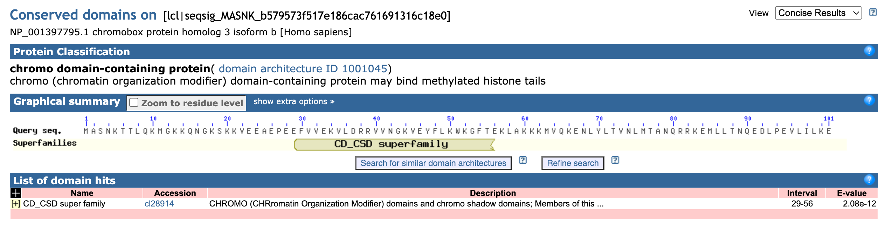
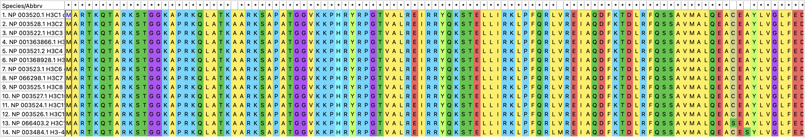
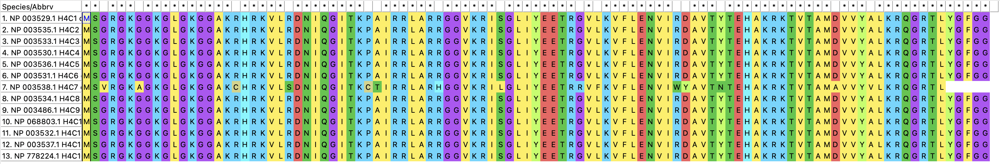
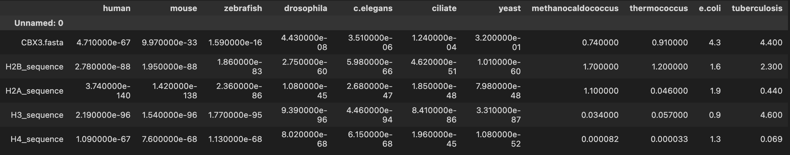
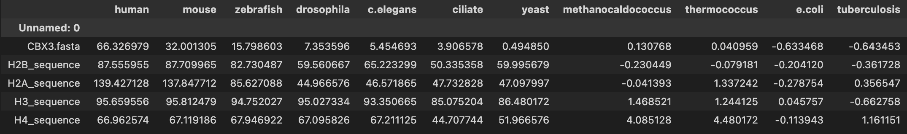
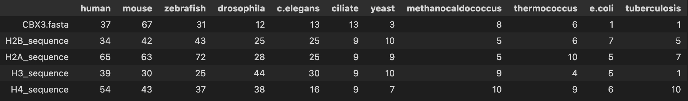
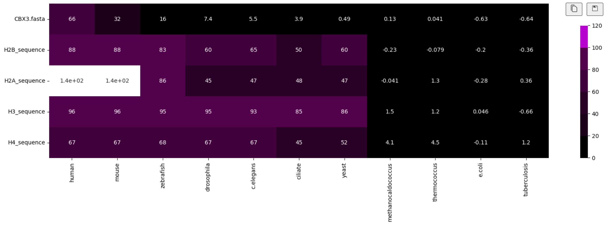

# hse23 minor project

## Общая информация о гене
**Ген:** CBX3
 **Эпигенетическая группа:** H3K9me
 **Эпигенетическая функция:** Histone modification read
 **Комплексы:** RING2-L3MBTL2, L3MBTL1
 **Домены:** 

CBX3 – chromobox protein 3 – связан с чтением гистоновых меток (об этом, в частности, написано в [этой статье](https://pubmed.ncbi.nlm.nih.gov/32979540/) – Three chromobox proteins (i.e., CBX1, **CBX3** or CBX5) associated with the heterochromatin protein 1 (HP1) complex are methyl readers that interpret H3K9me3 marks which are mediated by H3K9 methyltransferases (i.e., SUV39H1 or SUV39H2).) 

## Выравнивания
H2A: Есть различия, но пространственная структура схожая -> функции одинаковые. Сами последовательности отличаются, скорее всего, из-за мутаций и полиморфизма

H2B: Есть различия, но пространственная структура схожая -> функции одинаковые. Сами последовательности отличаются, скорее всего, из-за мутаций и полиморфизма

H3: Между последовательностями практически отсутствуют различия -> гены являются копиями

H4: Между последовательностями практически отсутствуют различия -> гены являются копиями

## Таблицы с e-value, -log(e-value), количеством хитов:
Табличка с e-value

Табличка с -log(e-value)

Табличка с количеством хитов

## Тепловая карта

## Устройство проекта
В файле data-analysis.ipynb – код для построения тепловой карты и работы с табличными данными при помощи pandas

В файле script.sh – скрипт, позволяющий запускать blast с нужными параметрами для всех протеомов не руками, а автоматически (нужно лишь заменить переменную query_name)

В файле get_values.py – скрипт, позволяющий по отчётам blast получить данные о e-values для всех протеомов

В файле get_hits.py – скрипт, позволяющий по отчётам blast получить данные о количестве хитов для всех протеомов

В папке img – все изображения (выравнивания из MEGA и тепловые карты)

[Ссылка на групповой проект](https://github.com/miamib34ch/HSE-BI-GroupProject) 
